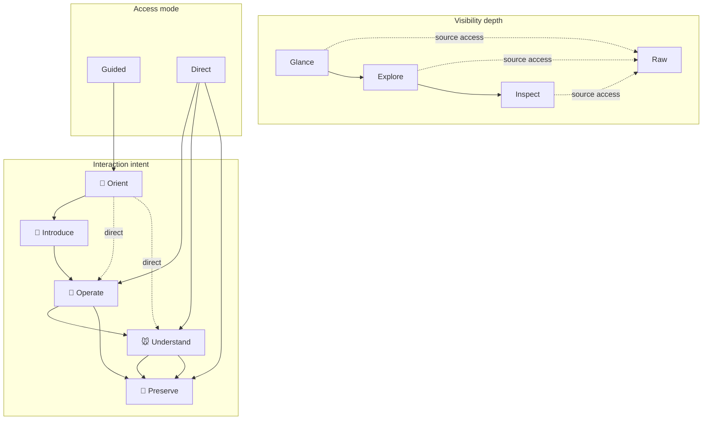

# Glass & Gears — Canonical Intent Matrix

Status: **canonical architecture specification**

This document formalizes the relationship between:

1. **visibility depth** — how much information is currently visible;
2. **interaction intent** — what the user is trying to do;
3. **access mode** — whether the user follows a guided path or jumps directly to a known target.

It extends the repository-wide rules in `AGENTS.md` and the design direction in `docs/INTERFACE_TRANSFORMATION_BLUEPRINT.md`.

It does **not** introduce a second navigation system, a second content model, or a second portal registry.

---

## 1. Canonical model

```text
GLASS & GEARS
│
├── Visibility depth
│   ├── Glance
│   ├── Explore
│   ├── Inspect
│   └── Raw
│
├── Interaction intent
│   ├── 🪎 Orient
│   ├── 🧚 Introduce
│   ├── 🐝 Operate
│   ├── 🐭 Understand
│   └── 🧀 Preserve
│
└── Access mode
    ├── Guided
    └── Direct
```

The three axes must remain distinct.

- Visibility depth answers: **How much is visible?**
- Interaction intent answers: **What is the user doing?**
- Access mode answers: **How does the user reach it?**

A page can change one axis without changing the others.

Example:

- A user may remain at `Inspect` depth while moving from `Understand` to `Preserve`.
- A user may move directly from `Glance` to `Operate` through a command palette.
- A user may open `Raw` while investigating either an operation or an explanation.

---

## 2. Visibility depth

Visibility depth controls information exposure. It is not a workflow and must not force a linear journey.

## 2.1 Glance

Purpose: immediate orientation.

Glance should communicate, within roughly five seconds:

- where the user is;
- what the page or object is;
- its current state;
- whether attention is required;
- the most useful next action.

Typical content:

- title;
- one short summary;
- one state signal;
- one primary action;
- up to three secondary actions;
- no more than five to seven major groups.

Glance must not contain:

- full documentation;
- long logs;
- raw configuration;
- exposed credentials;
- every available action;
- several equal-weight dashboards competing for attention.

## 2.2 Explore

Purpose: reveal the shape of the domain.

Explore should present meaningful groups such as:

- chapters;
- tool families;
- evidence clusters;
- settings groups;
- timeline phases;
- artifact collections;
- related workbenches.

Typical content:

- three to six grouped cards;
- short previews;
- counts, dates, or compact status metadata;
- search and filters;
- previews of available actions or deeper material.

Explore must remain legible without requiring the user to read every card.

## 2.3 Inspect

Purpose: expose complete working detail.

Inspect may contain:

- full text sections;
- tools and forms;
- tables and charts;
- logs and diagnostics;
- evidence ledgers;
- configuration;
- citations;
- advanced options;
- save and export results.

Inspect is allowed to be dense, but not disorganized.

Required structure:

- visible hierarchy;
- stable section position;
- search or table of contents for long material;
- contextual actions;
- explicit state and error handling;
- clear route back to Explore or Glance.

## 2.4 Raw

Purpose: show the original stored material.

Raw is a universal evidence and transparency layer. It is independent of the interaction cycle.

Raw may contain:

- original `.txt`;
- original `.md`;
- original `.seja`;
- JSON;
- logs;
- source metadata;
- source path;
- version or commit information;
- copy, download, or open-source controls.

Raw must preserve source meaning and wording. It must not silently reconcile contradictions, rewrite claims, or replace the source with a summary.

Raw is **not** a result and is **not** the Cheese phase.

---

## 3. Interaction intent

The intent spiral is a semantic vocabulary for user activity. It is not a mandatory sequence.

```text
🪎 Orient → 🧚 Introduce → 🐝 Operate → 🐭 Understand → 🧀 Preserve
```

This order describes a natural guided journey, but expert users may skip any step.

## 3.1 🪎 Orient

Question answered: **Where am I and what matters now?**

Responsibilities:

- establish context;
- show current state;
- identify urgency;
- expose the main entry point;
- provide a stable return point.

Typical UI:

- ambient header;
- page hero;
- state badge;
- recent or important item;
- compact visual overview;
- primary action.

Orient should feel calm, immediate, and trustworthy.

## 3.2 🧚 Introduce

Question answered: **What is here and where can I go?**

Responsibilities:

- explain the domain without a text wall;
- reveal meaningful groups;
- provide friendly previews;
- support first-time discovery;
- keep labels explicit and understandable.

Typical UI:

- category cards;
- chapter previews;
- short onboarding copy;
- guided path;
- `Explore` and `Tools` entry points;
- contextual illustration or restrained ambient motion.

Introduce must not become a compulsory tutorial.

## 3.3 🐝 Operate

Question answered: **What can I do?**

Responsibilities:

- expose functional tools;
- perform actions;
- configure behavior;
- provide immediate feedback;
- preserve user control;
- separate normal, repair, and destructive actions.

Typical UI:

- forms;
- tool tiles;
- terminal or command surfaces;
- filters;
- controls;
- tables;
- charts;
- safe action menus;
- explicit loading, success, and failure states.

Operate must favor precision over ornament.

## 3.4 🐭 Understand

Question answered: **Why is this true, how is it connected, and what supports it?**

Responsibilities:

- expose explanations;
- show evidence and counterevidence;
- reveal relationships;
- provide full reading depth;
- distinguish fact, interpretation, archive, mythology, and uncertainty.

Typical UI:

- evidence cards;
- ledger;
- long-form reading view;
- diagrams;
- timelines;
- relationship maps;
- citations;
- source links;
- expandable sections.

Understand must not disguise interpretation as telemetry or fact.

## 3.5 🧀 Preserve

Question answered: **What remains after this interaction?**

Responsibilities:

- save useful output;
- preserve selections;
- export results;
- create notes;
- create bookmarks;
- retain configuration;
- provide a traceable result.

Typical outputs:

- saved configuration;
- exported report;
- selected evidence set;
- journal entry;
- generated artifact;
- project note;
- favorite tool;
- shareable link;
- completion record.

Preserve creates or records something new. Raw reveals what already existed.

---

## 4. Access modes

## 4.1 Guided mode

Guided mode provides a calm visual path.

Characteristics:

- starts at Orient;
- uses clear grouped cards;
- reveals the next useful layer;
- minimizes visible complexity;
- explains unfamiliar domains;
- preserves a reliable back path.

Guided mode should feel like a well-designed path through a large workshop.

It must not:

- force unnecessary steps;
- hide expert functions permanently;
- use fake loading delays;
- require animation completion before action;
- trap the user inside a wizard.

## 4.2 Direct mode

Direct mode provides immediate expert access.

Entry points may include:

- command palette;
- search;
- stable URL;
- deep link;
- keyboard shortcut;
- recent item;
- favorite;
- explicit direct action;
- external automation.

Examples:

```text
Ctrl+K → Terminal
Search → Full evidence ledger
Deep link → Specific archive section
Recent → Last saved journal entry
```

Direct mode is the Android-freedom layer. It must remain visible and documented.

---

## 5. The matrix

The following table defines the most common combinations.

| Visibility | 🪎 Orient | 🧚 Introduce | 🐝 Operate | 🐭 Understand | 🧀 Preserve |
|---|---|---|---|---|---|
| **Glance** | Current state and primary route | One-sentence domain invitation | Primary safe action preview | Strongest insight or evidence preview | Last saved result or save-state signal |
| **Explore** | Domain map and grouped shelves | Guided category or chapter cards | Tool-family previews | Topic, timeline, or evidence previews | Saved-results collection preview |
| **Inspect** | Detailed state and context | Complete onboarding/reference detail when needed | Full tools, forms, logs, tables, and controls | Full ledger, documentation, diagrams, and citations | Save, export, bookmark, notes, history |
| **Raw** | Original status source | Original introductory source | Original configuration/log source | Original text, evidence, and metadata | Source of the preserved artifact plus artifact payload |

This table is descriptive, not exhaustive.

A product does not need to render every cell. It must correctly identify the cells it does render.

---

## 6. Mermaid architecture diagram



The dashed links represent valid non-linear access.

---

## 7. State model

A UI state should be describable using three fields.

```ts
type VisibilityDepth = 'glance' | 'explore' | 'inspect' | 'raw';

type InteractionIntent =
  | 'orient'
  | 'introduce'
  | 'operate'
  | 'understand'
  | 'preserve';

type AccessMode = 'guided' | 'direct';

type GlassAndGearsState = {
  depth: VisibilityDepth;
  intent: InteractionIntent;
  access: AccessMode;
  targetId?: string;
};
```

This type describes UI state. It must not become another portal registry.

Portal identity, route, category, kind, and availability remain in `src/data/portalRegistry.js`.

A route may optionally encode the state:

```text
#elysia?depth=inspect&intent=understand&section=morning-whispers
```

Stable URLs are preferred over hidden state for content users may bookmark or share.

---

## 8. Icon and label contract

Canonical rule:

> Recognition may begin with an icon, but meaning must remain explicitly named.

Required:

- icon plus visible label for primary navigation;
- accessible name for icon-only compact controls;
- consistent icon meaning within a screen;
- no reliance on color or icon alone for status;
- no collection of visually similar unlabeled sigils as the only navigation system.

Icons are hints. Labels are truth.

---

## 9. Button and action contract

Canonical rule:

> A guided primary action opens the next useful layer; a direct expert action may open an exact target immediately.

Examples:

Guided:

```text
Open workspace → Explore
Review evidence → Explore/Understand
Configure system → Explore/Operate
```

Direct:

```text
Open terminal → Inspect/Operate
Open raw log → Raw/Understand
Export current result → Inspect/Preserve
```

Danger actions must never be disguised as guided progression.

---

## 10. Motion mapping

Motion may reflect intent, but motion names must not become required application state.

Suggested mapping:

| Intent | Motion character | Purpose |
|---|---|---|
| 🪎 Orient | soft pulse or restrained bloom | acknowledge entry and establish context |
| 🧚 Introduce | curtain expansion and whisper fade | reveal grouped information gently |
| 🐝 Operate | compact tile response and modular snap | communicate precision and readiness |
| 🐭 Understand | paragraph reveal, underline, diagram draw | show ordered depth and relationships |
| 🧀 Preserve | subtle solidification and confirmation | show that a durable result now exists |

Constraints:

- motion is never required to understand state;
- reduced-motion mode must remain fully usable;
- no fake delays;
- no text movement during reading;
- ambient animation budget remains limited;
- direct actions must not wait for guided choreography.

---

## 11. Content truth labels

The interface may be poetic while metadata remains factual.

Use explicit labels such as:

- Research;
- Documented fact;
- Interpretation;
- Personal archive;
- Story;
- Mythology;
- Session record;
- Visual artifact;
- Technical prototype;
- Local service;
- Unverified note;
- Placeholder;
- Archived version.

Do not use visual polish to imply that a claim is live, verified, autonomous, or operational.

---

## 12. Component responsibilities

The matrix should converge toward reusable components.

### Shell

- `AmbientHeader` — Orient/Glance context;
- `PageHero` — Orient/Glance identity and primary route;
- `ShelfGrid` — Introduce/Explore grouping;
- `DetailSheet` — contextual Inspect layer;
- `ReadingView` — Understand/Inspect long-form view;
- `CommandPalette` — Direct access;
- `RawSourceView` — universal Raw layer.

### Working components

- `ToolTile` — Operate preview or entry;
- `OperationPanel` — full Operate/Inspect surface;
- `EvidenceCard` — Understand preview;
- `EvidenceLedger` — full Understand/Inspect surface;
- `ResultPanel` — Preserve/Inspect result;
- `SavedResultList` — Preserve/Explore collection;
- `StatusBadge` — compact state signal;
- `SourceLink` — traceability to Raw.

A component may support more than one intent, but its current intent should remain clear.

---

## 13. Pilot acceptance test

A representative pilot must demonstrate all of the following:

### Guided journey

```text
Glance/Orient
→ Explore/Introduce
→ Inspect/Operate or Inspect/Understand
→ Inspect/Preserve
```

### Direct journeys

```text
Glance/Orient
→ Inspect/Operate
```

and

```text
Glance/Orient
→ Inspect/Understand
```

### Raw access

Raw source must remain reachable from Glance, Explore, and Inspect without being the default opening surface.

### Preservation

At least one durable result must be created or saved, clearly distinct from the original source.

### Accessibility

The pilot must work with:

- keyboard;
- touch;
- reduced motion;
- visible focus;
- screen-reader labels;
- mobile safe areas;
- empty and error states.

---

## 14. Anti-solata constraints

Do not create:

- a second portal registry;
- a second router map;
- a separate component tree for each emoji phase;
- mandatory linear navigation through all five intents;
- icon-only mystery navigation;
- duplicated raw and preserved content;
- mythology presented as runtime state;
- new terms for existing concepts without a concrete interface responsibility.

The emoji vocabulary is a semantic aid. The technical architecture remains ordinary, inspectable, and testable.

---

## 15. Final canonical statements

> Visibility depth controls how much the user sees.

> Interaction intent describes what the user is doing.

> Access mode determines whether the route is guided or direct.

> Raw reveals what already existed.

> Preserve records what the interaction produced.

> Icons invite recognition; labels preserve meaning.

> Beautiful guidance must not remove expert control.

> First establish one source of truth. Then let the beautiful interface reveal it.
